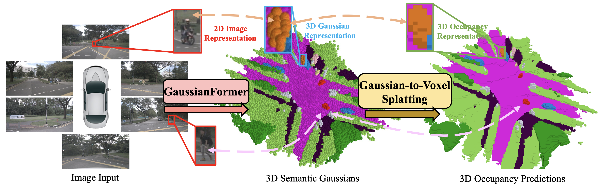
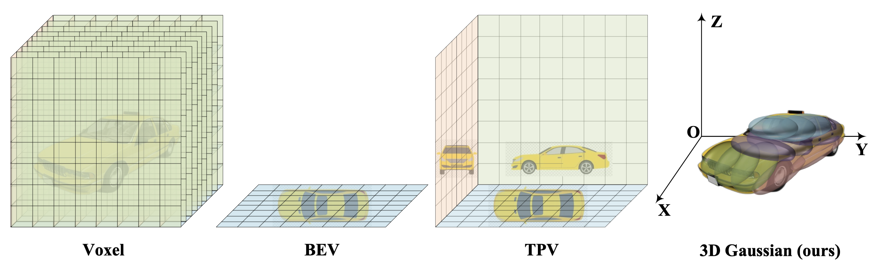
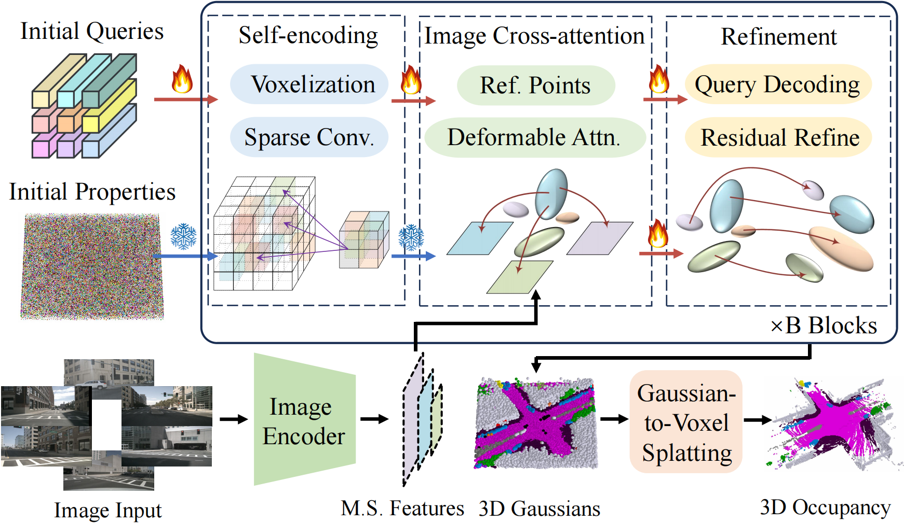

# GaussianFormer: Scene as Gaussians for Vision-Based 3D Semantic Occupancy Prediction
### [Paper](https://arxiv.org/abs/2405.17429)  | [Project Page](https://wzzheng.net/GaussianFormer) 

> GaussianFormer: Scene as Gaussians for Vision-Based 3D Semantic Occupancy Prediction

> [Yuanhui Huang](https://scholar.google.com/citations?hl=zh-CN&user=LKVgsk4AAAAJ), [Wenzhao Zheng](https://wzzheng.net/)$\dagger$, [Yunpeng Zhang](https://scholar.google.com/citations?user=UgadGL8AAAAJ&hl=zh-CN&oi=ao), [Jie Zhou](https://scholar.google.com/citations?user=6a79aPwAAAAJ&hl=en&authuser=1), [Jiwen Lu](http://ivg.au.tsinghua.edu.cn/Jiwen_Lu/)$\ddagger$

$\dagger$ Project leader $\ddagger$ Corresponding author

💥A pioneering step towards building an object-centric autonomous driving system. 💥

GaussianFormer proposes the 3D semantic Gaussians as **a more efficient object-centric** representation for driving scenes compared with 3D occupancy.  



## News.
- **[2024/09/05]** An updated version of GaussianFormer modeling only the occupied area.
- **[2024/09/05]** Model weights and evaluation code release.
- **[2024/05/28]** Paper released on [arXiv](https://arxiv.org/abs/2405.17429).
- **[2024/05/28]** Demo release.

## Demo


## Overview


Considering the universal approximating ability of Gaussian mixture, we propose an object-centric 3D semantic Gaussian representation to describe the fine-grained structure of 3D scenes without the use of dense grids. We propose a GaussianFormer model consisting of sparse convolution and cross-attention to efficiently transform 2D images into 3D Gaussian representations. To generate dense 3D occupancy, we design a Gaussian-to-voxel splatting module that can be efficiently implemented with CUDA. With comparable performance, our GaussianFormer reduces memory consumption of existing 3D occupancy prediction methods by 75.2% - 82.2%.



## Getting Started

### Installation
The environment is almost the same as [SelfOcc](https://github.com/huang-yh/SelfOcc) except for two additional CUDA operations.

```
1. Follow instructions in SelfOcc to prepare the environment. Not that we do not need packages related to NeRF, so feel safe to skip them.
2. cd model/encoder/gaussian_encoder/ops && pip install -e .  # deformable cross attention with image features
3. cd model/head/localagg && pip install -e .  # Gaussian-to-Voxel splatting
```

### Data Preparation
1. Download nuScenes V1.0 full dataset data [HERE](https://www.nuscenes.org/download).

2. Download the occupancy annotations from SurroundOcc [HERE](https://github.com/weiyithu/SurroundOcc) and unzip it.

3. Download pkl files [HERE](https://cloud.tsinghua.edu.cn/d/bb96379a3e46442c8898/).

**Folder structure**
```
GaussianFormer
├── ...
├── data/
│   ├── nuscenes/
│   │   ├── maps/
│   │   ├── samples/
│   │   ├── sweeps/
│   │   ├── v1.0-test/
|   |   ├── v1.0-trainval/
│   ├── nuscenes_cam/
│   │   ├── nuscenes_infos_train_sweeps_occ.pkl
│   │   ├── nuscenes_infos_val_sweeps_occ.pkl
│   ├── surroundocc/
│   │   ├── samples/
│   │   |   ├── xxxxxxxx.pcd.bin.npy
│   │   |   ├── ...
```

### Inference
We provide two checkpoints trained on the SurroundOcc dataset:

1. The [checkpoint](https://cloud.tsinghua.edu.cn/f/725ae97dcea7474589f5/?dl=1) that reproduces the result in Table.1 of our paper.

2. 🔥🔥An [updated version](https://cloud.tsinghua.edu.cn/f/e03def54f37d49088d66/?dl=1) of GaussianFormer which assigns semantic Gaussians to model only the occupied area while leaving the empty space to one fixed infinitely large Gaussian.
This modification can significant reduce the number of Gaussians to achieve similar model capacity (144000 -> 25600), thus being even more efficient.
Check our [GaussianHead](model/head/gaussian_head.py) for more details.

```
python eval.py --py-config config/nuscenes_gs144000.py --work-dir out/nuscenes_gs144000/ --resume-from out/nuscenes_gs144000/state_dict.pth

python eval.py --py-config config/nuscenes_gs25600_solid.py --work-dir out/nuscenes_gs25600_solid/ --resume-from out/nuscenes_gs25600_solid/state_dict.pth
```

## Related Projects

Our work is inspired by these excellent open-sourced repos:
[TPVFormer](https://github.com/wzzheng/TPVFormer)
[PointOcc](https://github.com/wzzheng/PointOcc)
[SelfOcc](https://github.com/huang-yh/SelfOcc)
[SurroundOcc](https://github.com/weiyithu/SurroundOcc) 
[OccFormer](https://github.com/zhangyp15/OccFormer)
[BEVFormer](https://github.com/fundamentalvision/BEVFormer)

Our code is originally based on [Sparse4D](https://github.com/HorizonRobotics/Sparse4D) and migrated to the general framework of [SelfOcc](https://github.com/huang-yh/SelfOcc).

## Citation

If you find this project helpful, please consider citing the following paper:
```
@article{huang2024gaussian,
    title={GaussianFormer: Scene as Gaussians for Vision-Based 3D Semantic Occupancy Prediction},
    author={Huang, Yuanhui and Zheng, Wenzhao and Zhang, Yunpeng and Zhou, Jie and Lu, Jiwen},
    journal={arXiv preprint arXiv:2405.17429},
    year={2024}
}
```